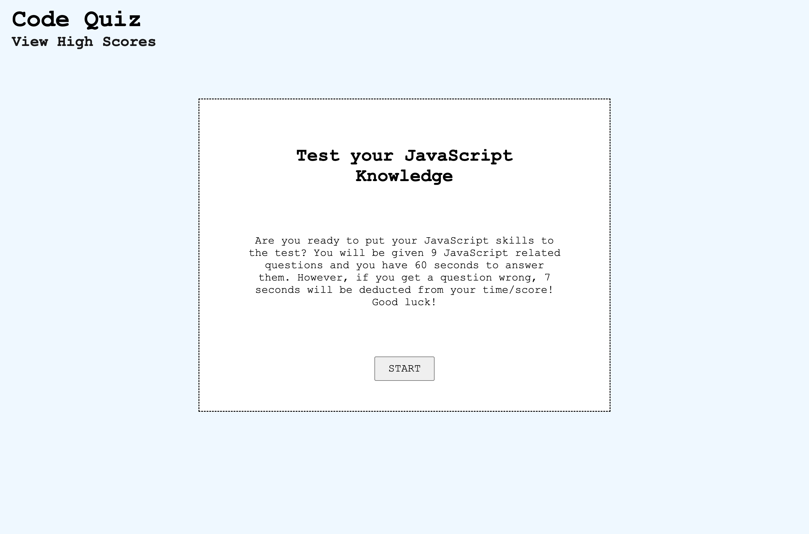
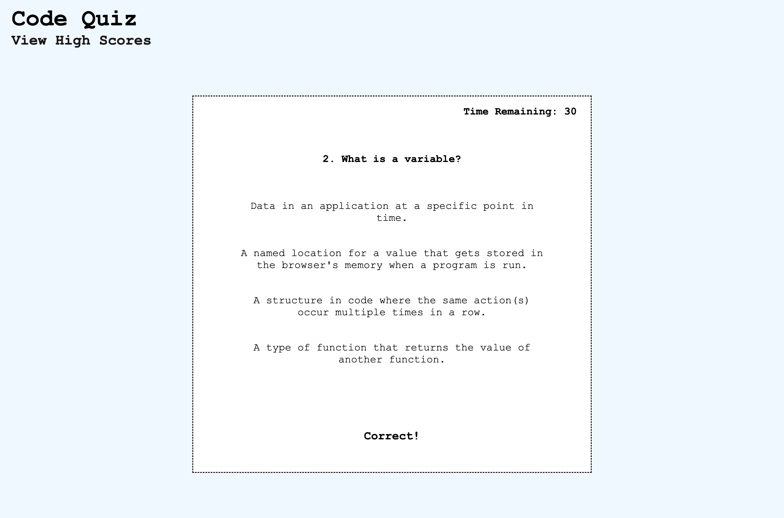
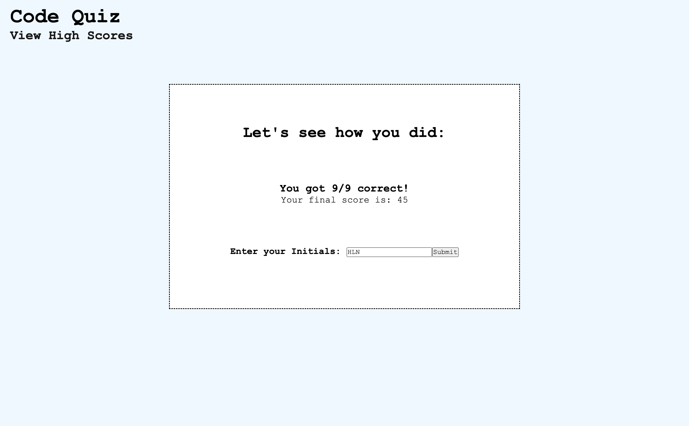
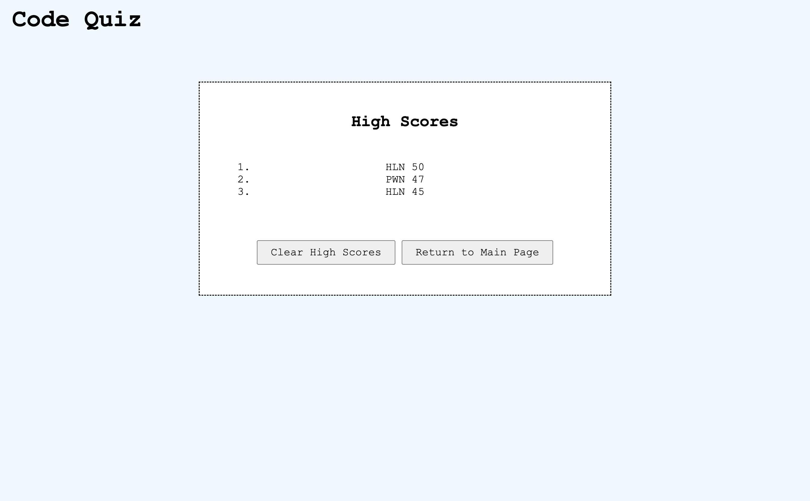

# Code Quiz

Code Quiz is a mini-game that tests the user's knowledge on JavaScript. The user will have 60 seconds to answer 9 questions. If the user selects an incorrect answer, 7 seconds will be deducted from their time/final score. When the user completes the quiz, they will be shown how many questions they got correct, their overall score, and will have the opportunity to add their score to 'High Scores', which is stored in the user's localStorage. Once the user submits their initials, they will be shown a list of all submitted scores from localStorage.

## Built With:

- JavaScript
- HTML
- CSS

## Links
- [GitHub Repository](https://github.com/hlnicks/code-quiz)
- [GitHub Page](https://hlnicks.github.io/code-quiz/)

## Screenshots

&nbsp;

&nbsp;

&nbsp;

